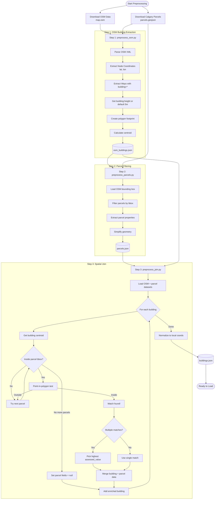

# Urban 3D City Dashboard

Interactive 3D Visualization + Natural Language Querying  
MASIV 2025 Internship Technical Challenge

---

## Live Demo

https://urban-3d-dashboard.vercel.app

---

## Overview

This project is a complete web-based 3D city dashboard for Calgary, capable of:
- Rendering real building footprints in 3D using Three.js
- Displaying property assessments, zoning, lot sizes, and land-use data
- Responding to natural language queries (e.g. "show buildings over $1M with lots under 300 sqm")
- Highlighting matching buildings in real-time
- Allowing users to inspect individual buildings with detailed metadata
- Running entirely in the browser + a lightweight Flask backend

The system integrates:
- React + React Three Fiber for 3D visualization
- Python Flask API for data and LLM filtering
- Groq Llama-3.3-70B for natural language interpretation
- Custom preprocessing pipeline for merging OSM and Calgary Parcel datasets

---

## Core Features

### 3D Visualization
- Buildings extruded from real OSM footprints
- Heights sourced from OSM data.
- Ground plane, camera controls, smooth interactions
- Clicking a building highlights it and opens a detail panel

### Rich Building Data

Each building displays:
- Address
- Assessed property value
- Community
- Land-use zoning
- Lot size (sqm + acres)
- Property classification
- Roll number
- Footprint geometry
- Height

### Smart Natural Language Querying

Examples:
- "show buildings over 12m"
- "most expensive property"
- "cheapest home"
- "land size over 600 sqm"
- "commercial buildings in downtown east village"
- "buildings under $1M and taller than 10m"
- "find largest lot in this map"

The LLM produces structured JSON filters that the backend applies to the local dataset.

Fallback regex parser ensures the system works even if the LLM fails.

---

## Project Structure
```
urban-3d-dashboard/
│
├── backend/
│   ├── app.py
│   ├── data_loader.py
│   ├── preprocess_osm.py
│   ├── preprocess_parcels.py
│   ├── preprocess_join.py
│   ├── data/
│   │   ├── buildings.json      ← final dataset used by backend
│   │   └── raw/                ← raw OSM/parcel datasets
│   ├── requirements.txt
│   └── README_backend.md
│
└── frontend/
    ├── src/
    │   ├── components/
    │   ├── hooks/
    │   ├── types/
    │   └── utils/
    ├── package.json
    ├── vite.config.ts
    └── README_frontend.md
```

---

## Setup Instructions

### 1) Clone the Repository
```bash
git clone https://github.com/dave22r/urban-3d-dashboard
cd urban-3d-dashboard
```

### 2) Backend Setup (Flask + Groq)

Create virtual environment:
```bash
cd backend
python3 -m venv venv
source venv/bin/activate
```

Install dependencies:
```bash
pip install -r requirements.txt
```

Add Groq API Key:

Use the .env.example file as a format for your .env file

How to get a Groq API key (FREE):
1. Go to https://console.groq.com
2. Sign in with GitHub/Google
3. Go to API Keys
4. Create a new key
5. Paste it into the .env file

---

## Deployments

Frontend (Vercel)
- Automatic deploy on every push to main
- Live URL already active: https://urban-3d-dashboard.vercel.app

Backend (Render)
- Gunicorn server
- Auto deploy on commit
- Live API: https://urban-3d-dashboard.onrender.com/api/health

---

## To Run Backend Locally
```bash
python app.py
```

Backend runs at: http://127.0.0.1:5000

Check health: http://127.0.0.1:5000/api/health

---

## Local Frontend Setup (React + Three.js)

Install dependencies:
```bash
cd frontend
npm install
```

Start dev server:
```bash
npm run dev
```

Frontend runs at: http://localhost:5173

---

## How to Run the Preprocessing Pipeline (Optional)

Only required if you want to regenerate buildings.json using new OSM or parcel datasets

Step 1 — Extract OSM buildings:
```bash
python preprocess_osm.py
```

Step 2 — Filter parcels to bounding box:
```bash
python preprocess_parcels.py
```

Step 3 — Spatial join:
```bash
python preprocess_join.py
```

Output is saved to: backend/data/buildings.json

---

## API Endpoints

### GET /api/buildings

Returns the full building dataset.

### POST /api/query

Request:
```json
{
  "query": "buildings over 10m"
}
```

Response:
```json
{
  "ids": [12, 15, 33],
  "count": 3
}
```

### GET /api/health

Shows backend status and LLM availability.

---

## Appendix


Below is the Preprocessing pipeline diagram for reference.
**Note: UML Diagram is also in the root repository by the name "uml diagram mmd.png"**




